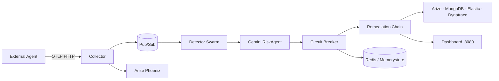

# OrchestraOS Loop Sentinel

**Every other platform tells you your agent failed. OrchestraOS makes sure it doesn't.**

A Multi-Agent Reliability OS for the [Google Cloud Rapid Agent Hackathon](https://cloud.google.com/events/rapid-agent-hackathon). OrchestraOS observes, protects, and auto-recovers **external** AI agents (AutoGPT, CrewAI, LangGraph, MCP, custom) — agents never run inside OrchestraOS; we only watch and intervene.

| Track | Integration |
|-------|-------------|
| **Primary** | [Arize Phoenix](https://docs.arize.com/phoenix) — OTLP trace export |
| **Secondary** | Dynatrace APM, Elastic, MongoDB Atlas, GitLab |
| **Platform** | Google Cloud — Gemini Flash, Pub/Sub, Cloud Run, Memorystore, Secret Manager |

---

## The money shot

| | Unprotected | Protected (OrchestraOS) |
|---|-------------|-------------------------|
| **Calls** | 400 | 5 |
| **Duration** | 20 min | 47 sec |
| **Cost** | $42.00 | $0.36 |
| **Outcome** | FAILURE | RECOVERED |
| **Savings** | — | **99.1% cost reduction** |

Live scenario: AutoGPT infinite loop — repeated `web_search` with identical params. OrchestraOS detects the loop on call 3, trips the circuit breaker at `risk_score > 0.8`, and remediates within 5 calls.

---

## Architecture

```
External Agent → OpenTelemetry → Collector (:4318)
    → Pub/Sub → Detector Swarm (6 agents + fusion)
    → Gemini RiskAgent → Circuit Breaker (Redis)
    → Remediation Chain → Partner Exports → Dashboard
```



### Services (6 logical agents, not 50 microservices)

| Service | Role |
|---------|------|
| **Collector** | FastAPI OTLP receiver; publishes `raw-spans` |
| **Detectors** | Loop, Progress, Token, Latency, Context, Error + Feature Fusion |
| **Monitor** | Gemini Flash risk classification + deterministic fallback |
| **Breaker** | Redis state machine: closed → open → half-open |
| **Remediation** | Retry → Rewrite → Rollback → Fallback → Escalate |
| **Partners** | Fan-out to Arize, MongoDB, Elastic, Dynatrace, GitLab |
| **Dashboard** | Light-theme React UI — two-pane demo, incidents, metrics |

---

## Quick start (local)

**Requirements:** Python 3.11+, [Poetry](https://python-poetry.org/), Docker (optional)

```bash
poetry install
cp .env.example .env
```

### Run tests (79 passing)

```bash
poetry run pytest tests/ -v
```

### Full stack with Docker

```bash
docker compose up --build
```

| Port | Service |
|------|---------|
| 4318 | Collector (OTLP `/v1/traces`) |
| 8080 | Dashboard |
| 6379 | Redis |
| 8085 | Pub/Sub emulator |
| 27017 | MongoDB (partners) |

### CLI demo (terminal)

```bash
# Side-by-side AutoGPT scenario
poetry run orchestraos-demo

# Unprotected only — 400 calls, $42, FAILURE
poetry run python -c "from agent_harness.unprotected_agent import run_unprotected_demo; run_unprotected_demo()"

# Protected only — breaker + remediation, RECOVERED
poetry run python -c "from agent_harness.protected_agent import run_protected_demo; run_protected_demo()"
```

### Dashboard

```bash
# Terminal 1 — API + static frontend
poetry run orchestraos-dashboard

# Terminal 2 — build frontend (first time, bash)
cd dashboard
npm install
npm run dev
```

```powershell
# Terminal 2 — build frontend (first time, PowerShell)
cd dashboard; npm install; npm run dev
```

Open **http://localhost:8080** (production build) or **http://localhost:5173** (Vite dev). Click **Run live demo** for the side-by-side comparison.

### Send a test span

```bash
curl -X POST http://localhost:4318/v1/traces \
  -H "Content-Type: application/json" \
  -d '{
    "trace_id": "t1",
    "span_id": "s1",
    "session_id": "demo",
    "tool_name": "web_search",
    "params": {"q": "agent status"},
    "token_count": 50,
    "latency_ms": 120
  }'
```

---

## Poetry commands

| Command | Description |
|---------|-------------|
| `poetry run orchestraos-collector` | OTLP collector |
| `poetry run orchestraos-detectors` | Detector worker |
| `poetry run orchestraos-monitor` | Gemini risk worker |
| `poetry run orchestraos-breaker` | Circuit breaker worker |
| `poetry run orchestraos-remediation` | Remediation worker |
| `poetry run orchestraos-partners` | Partner export worker |
| `poetry run orchestraos-dashboard` | Dashboard API |
| `poetry run orchestraos-demo` | AutoGPT harness demo |

---

## Deploy to Google Cloud

See **[docs/DEPLOY.md](docs/DEPLOY.md)** for Cloud Run, Memorystore, Secret Manager, and Artifact Registry.

```bash
export GCP_PROJECT=your-project-id
bash scripts/setup_gcp.sh
export GEMINI_API_KEY=your-key
bash scripts/provision_secrets.sh
gcloud builds submit --config=cloudbuild.yaml
bash scripts/deploy_cloud_run.sh
```

```powershell
$env:GCP_PROJECT = "your-project-id"
bash scripts/setup_gcp.sh
$env:GEMINI_API_KEY = "your-key"
bash scripts/provision_secrets.sh
gcloud builds submit --config=cloudbuild.yaml
bash scripts/deploy_cloud_run.sh
```

---

## Repository layout

```
orchestraos/
├── collector/          # OTLP ingestion (:4318)
├── detectors/          # 6 detector agents + swarm
├── monitor_model/      # Gemini RiskAgent
├── breaker/            # Circuit breaker + health agent
├── remediation/        # Recovery orchestrator + 5 agents
├── integrations/       # Arize, MongoDB, Elastic, Dynatrace, GitLab
├── agent_harness/      # Demo agents + replay cards
├── dashboard/          # React 18 + Vite + Tailwind (light theme)
├── shared/             # schemas, config, pubsub, cloudrun
├── configs/            # partners.yaml, gcp.yaml
├── infra/              # Dockerfiles, Cloud Run YAML
├── scripts/            # setup_gcp.sh, deploy_cloud_run.sh
├── docs/               # DEPLOY.md, VIDEO_SCRIPT.md, SUBMISSION.md
└── tests/              # 79 pytest tests
```

---

## Hackathon submission

| Asset | Location |
|-------|----------|
| Team onboarding | [docs/TEAM_SETUP.md](docs/TEAM_SETUP.md) |
| Branching (ready-made branches) | [docs/BRANCHING.md](docs/BRANCHING.md) |
| GitHub public + branch protection | [docs/GITHUB_SETUP.md](docs/GITHUB_SETUP.md) |
| GCP shared project | [docs/GCP_SETUP.md](docs/GCP_SETUP.md) |
| Contributing / PR rules | [CONTRIBUTING.md](CONTRIBUTING.md) |
| Demo video script (3 min) | [docs/VIDEO_SCRIPT.md](docs/VIDEO_SCRIPT.md) |
| Submission checklist | [docs/SUBMISSION.md](docs/SUBMISSION.md) |
| Screenshot guide | [docs/screenshots/README.md](docs/screenshots/README.md) |
| Architecture deep-dive | [docs/ARCHITECTURE.md](docs/ARCHITECTURE.md) |

**Live demo URL:** https://orchestraos-dashboard-397417416325.us-central1.run.app _(currently unreachable — use `poetry run orchestraos-dashboard` locally until redeploy)_

**Video URL:** _add YouTube/Loom link_

---

## Partner integrations

Enable via `PARTNER_<NAME>_ENABLED=true` in `.env` (local) or Secret Manager (prod). See `.env.example`.

| Partner | Trigger |
|---------|---------|
| Arize Phoenix | Every span at collector + traces |
| MongoDB Atlas | Breaker trips + remediation plans |
| Elastic | Event indexing |
| Dynatrace | Custom APM events |
| GitLab | Issue on human escalation |

---

## License

MIT — see [LICENSE](LICENSE).
